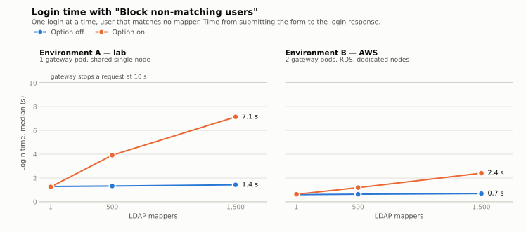
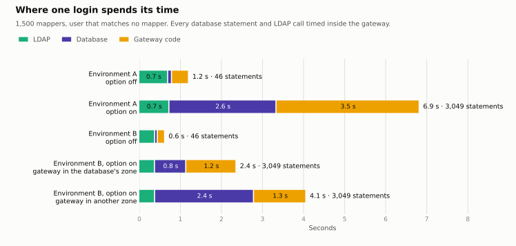
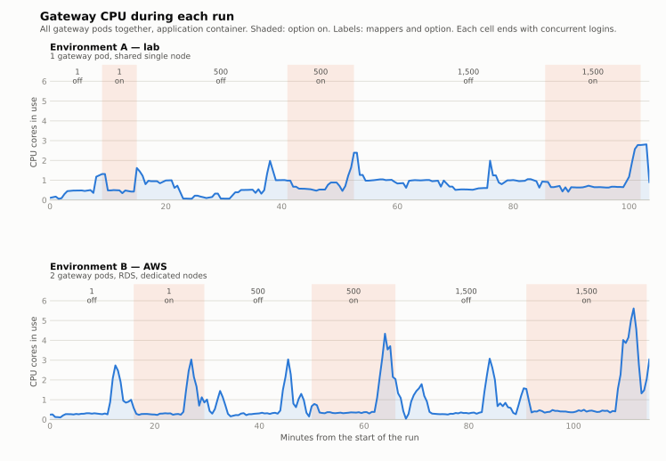
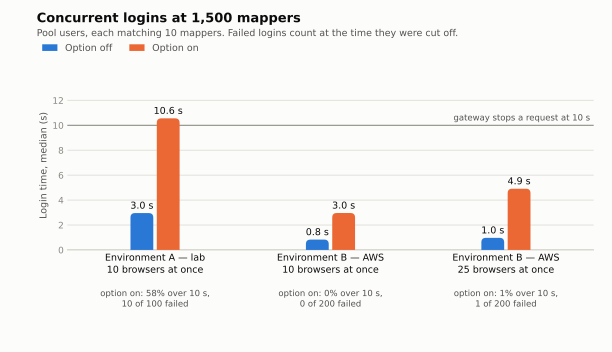

# AAP 2.6: what "Block non-matching users" costs at 1,500 LDAP mappers

A performance report on one option of the LDAP authenticator mappers in
Ansible Automation Platform 2.6, measured with real browser logins in two
environments.

**Status:** Environment A complete. Environment B: main runs complete, scaling
and tuning tests still to come.

## The finding

> With 1,500 mappers, turning the option on makes **every login 3 to 5 times
> slower**, because the gateway checks each mapper's role against the
> database, one mapper at a time: 3,000 extra statements per login. Better hardware shrinks the
> delay but does not remove it. Logins that pass 10 seconds are cut off, which
> locks out new users who are in many groups.

| | Environment A: lab | Environment B: AWS |
|---|---|---|
| Login, option off | 1.4 s | 0.7 s |
| Login, option on | **7.1 s** | **2.4 s** or **4.2 s**, by gateway pod |
| Database statements per login, off → on | 46 → 3,049 | 46 → 3,049 |
| 10 logins at once, option on | 10.6–12.1 s, 10–16% failed | 2.9–3.0 s, none failed |
| New user in 150 groups, option on | Locked out after 5 attempts | In on the 3rd attempt |

1,500 mappers, one login at a time unless stated, a user who matches none of
the mappers.

## 1. The option makes every login slower, in step with the mapper count

<picture>
  <source media="(prefers-color-scheme: dark)" srcset="docs/charts/toggle-cost-dark.svg">
  
</picture>

- **Option off:** mapper count is nearly free. 1,500 mappers cost about 0.1 s
  more than 1.
- **Option on:** each mapper the user does *not* match adds 1 to 5 ms.
- **It is the option, not drift.** Measured off → on → off, login time
  returned to where it started, within 6%.

## 2. The time goes to the same two lookups, repeated per mapper

<picture>
  <source media="(prefers-color-scheme: dark)" srcset="docs/charts/time-split-dark.svg">
  
</picture>

Measured inside the gateway, timing every database statement and LDAP call of
a real login.

| Statement added by the option | Times per login |
|---|---|
| Look up the role definition | 1,501 |
| Look up the content type | 1,500 |

- All 1,500 mappers grant the same role, so these fetch **the same two rows
  1,500 times each**.
- They come from a check that validates each mapper's role before it is
  applied. With the option off, mappers the user does not match never reach
  that check. With it on, all of them do.
- **Nothing is written.** The number of updates is 7 with the option off and
  7 with it on.
- **Option off, a login is mostly LDAP:** three binds, about 60% of the time.

## 3. Half computing, half waiting, and no server is short of capacity

<picture>
  <source media="(prefers-color-scheme: dark)" srcset="docs/charts/gateway-cpu-dark.svg">
  
</picture>

During the slowest one-at-a-time logins, 1,500 mappers with the option on:

| | Environment A | Environment B |
|---|---|---|
| Gateway CPU in use | 0.65 cores | 0.45 cores |
| Gateway CPU per login, option off → on | 2.3 → 6.2 CPU-seconds | 0.8–1.5 → 2.2–2.5 CPU-seconds |
| Gateway memory | 1.4 GiB | 2.1 GiB |
| Database CPU | not recorded | 2.4% of 8 vCPU |
| Directory server CPU | not recorded | 0.6% of 16 vCPU |

- **About half of a slow login is the gateway computing, half is waiting.**
  Building 3,000 queries and unpacking their results is Python work: the
  gateway spends 2 to 3 times more CPU on a login with the option on.
- **Nothing is short of capacity.** One login at a time keeps the gateway at
  about half a core whether logins take 1 s or 7 s, and the database and
  directory servers are close to idle.
- **Distance to the database matters more than its size.** In Environment B
  the gateway pod in the database's zone needs 0.23 ms per statement and the
  pod in another zone 0.77 ms. Times 3,049 statements, that is 2.4 s against
  4.1 s for the same login, measured in the pods; browsers saw 2.4 s and
  4.2–4.3 s.
- **CPU is a poor warning sign.** While logins slowed from 0.6 s to 7 s under
  load, gateway CPU stayed at 9–27% of its request.

CPU and memory for every test and component:
[what affects login time](docs/what-affects-login-time.md#cpu-and-memory-in-every-test).

## 4. Under concurrent logins, slow becomes failed

<picture>
  <source media="(prefers-color-scheme: dark)" srcset="docs/charts/concurrency-dark.svg">
  
</picture>

| Limit | Value |
|---|---|
| Workers per gateway pod | 5, not configurable |
| A request is cut off after | 10 s: the user sees *Service Unavailable* |
| A request waiting for a worker is dropped after | 15 s: *Gateway Timeout* |
| Directory server | 3 binds per login, about 130 ms of CPU each |

- With the option on, each worker serves 3 to 5 times fewer logins.
- **New users in many groups are locked out.** Their first login creates
  teams and roles inline and does not fit in 10 seconds.
- **The directory server capped logins at 5 per second** on 4 vCPU, whatever
  the number of gateway pods. On 16 vCPU it serves four times as many binds.

## 5. The gateway cannot scale itself

| Test | Result |
|---|---|
| Scale the gateway by hand, 2 → 3 pods | Reverted by the operator after 35 s |
| HorizontalPodAutoscaler | Flaps: 22 pods created and destroyed in 37 minutes |
| Replica count in the platform resource | Holds. 77 s until the new pods are ready |

The operator rewrites the replica count on every run and has no autoscaling
setting. A workaround with KEDA is prototyped; it has not been tested under
load.

## The two environments

| | A: lab | B: AWS |
|---|---|---|
| Purpose | Small and shared: a lower bound | Dedicated, managed database |
| Platform | OpenShift 4.20, 1 node, 16 vCPU, shared | OpenShift 4.20, 3 workers, 24 vCPU |
| Gateway | 1 pod | 2 pods, in two zones |
| Database | EDB Postgres 15.18 on a VM | Amazon RDS PostgreSQL 15.18, Multi-AZ |
| Directory | FreeIPA 4.12.2 | FreeIPA 4.12.2, 16 vCPU |
| AAP | 2.6, same operator build | 2.6, same operator build |
| Browser logins measured | 1,770 | 5,871 |

Results are only meaningful together with the infrastructure they ran on.

## How much to trust this

| Solid | Less solid |
|---|---|
| Statement counts: exact, identical in both environments | One run per configuration, except 1,500 mappers |
| Where the lookups come from: captured as stack traces | The two environments differ in more than hardware: gateway pods, user pool, LDAP limits |
| The slowdown: reproduced in 4 runs, drift-checked in both environments | 50 browsers at once could not be measured: the load generator was the limit |
| The 10 s cut-off: seen in gateway logs and traced to its setting | Environment A database and directory hosts were not monitored |
| Browser and in-gateway measurements agree within a few percent | Time in "gateway code" was not profiled further |

All mappers in the test are team mappers granting one role. With several roles
the number of lookups would be the same.

## More

| Page | Content |
|---|---|
| [What affects login time](docs/what-affects-login-time.md) | The full account, with CPU and memory for every test |
| [Environment A](docs/environment-a.md) | Infrastructure, all result tables, limitations |
| [Environment B](docs/environment-b.md) | Infrastructure, all result tables, limitations |
| [The option and the test](docs/test-design.md) | What the option is, how the test is built |
| [Running the test](docs/usage.md) | Scripts, settings, teardown |
| [Independent review](ADVISOR_REVIEW.md) | Critique of the method, and [what was done about it](CHANGELOG.md) |
| `results/` | Raw login records, gateway and database metrics, probe results |
